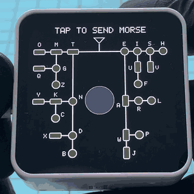

# Morse Tree

A Morse code trainer for the Waveshare ESP32-C6-Touch-AMOLED-2.16. You key letters by touching
the screen, and a decoding tree on the display shows where you are in the code.

Touch anywhere on the screen. A short touch is a dot, a longer one is a dash, and a tone
sounds while your finger is down. The keyed path lights up in the tree: dots are green
circles, dashes are red rectangles, and the antenna at the top turns yellow while you touch.
When you pause, the letter is added to the line at the top and the tree clears.



## Controls

| Input | Effect |
|---|---|
| Touch, under 200 ms | dot |
| Touch, 200 ms or longer | dash |
| Pause of 0.9 s | the letter is added to the top line, the tree clears, and a blinking dot marks where the next letter goes |
| Pause of 2.1 s | a space is added and the dot becomes an underscore: the next letter starts a new word |
| Pause of 5 s | the letters clear and the instruction returns |
| Two fingers on the screen | cancel the letter and the letters on the top line |
| KEY and BOOT together | the same cancel |
| KEY / BOOT | volume up / down, in steps of 5 from 0 to 60; hold to repeat |

The pauses follow the standard proportions, 3 units between letters and 7 between words,
with a unit of 300 ms. The top line holds the last 18 characters; the oldest drop off the left. A path that leaves the
tree (a fifth symbol, say) clears itself. The volume starts at 20 on every boot, because the
speaker is loud. The picture turns to follow gravity, so the top of the picture is the edge
of the module that is up; lying flat keeps whatever it had.

## Hardware

[Waveshare ESP32-C6-Touch-AMOLED-2.16](https://www.waveshare.com/esp32-c6-touch-amoled-2.16.htm):
ESP32-C6, 480x480 AMOLED (SH8601, QSPI), CST9217 touch, ES8311 audio codec, QMI8658 IMU,
AXP2101 power management. No other parts are needed, only a USB-C cable that carries data.

## Install from the browser

No toolchain needed. You need desktop Chrome or Edge (Safari and Firefox cannot talk to a
serial port), and a USB-C cable that carries data.

The quickest way: open https://dannyow.github.io/morse-tree-amoled/, press **Install**
and pick the module's serial port. It flashes the latest release.

The same by hand, with Espressif's web flasher:

1. Download `morse-tree-<version>-esp32c6-16mb.bin` from the Releases page of this repository.
2. Connect the module to the computer with a USB-C data cable.
3. Open Espressif's web flasher, https://espressif.github.io/esptool-js/, set the baud rate
   to 921600 and press **Connect**. Pick the module's serial port.
4. Under **Flash Address** enter `0x0`, choose the downloaded `.bin` and press **Program**.
5. When it finishes, unplug the module and plug it back in. The module has no reset button.

The image contains the bootloader and the partition table, so it replaces whatever the
module ran before. If **Connect** fails, hold BOOT while you plug the module in, then try
again.

## Build from source

The project uses [PlatformIO](https://platformio.org/). The toolchain is pinned in
`firmware/platformio.ini`, and the first build downloads it.

```
cd firmware
pio run -t upload          # build and flash over USB
pio device monitor         # serial, 115200
```

Pass `--upload-port` if PlatformIO picks the wrong port. Flashing with `pio run -t upload`
keeps the saved settings in flash; the firmware does not store any yet.

## Serial

At 115200 baud the firmware prints every symbol, letter, volume change and rotation.

## Settings

The timings and the sound are constants at the top of `firmware/src/main.cpp`:
`DOT_MAX_MS`, `UNIT_MS` (the letter and word gaps are 3 and 7 times it), `TEXT_RESET_MS`,
`TONE_HZ`, `TONE_LEVEL`, `VOLUME_START`, `VOLUME_MAX` and `MAX_TEXT`. Change them if 200 ms
is the wrong boundary for your hand, or to key faster.

## Known limits

- Letters drop off the top line at once; there is no slide.

## Layout

| Path | What |
|---|---|
| `firmware/src/main.cpp` | the app: the tree, the decoder, drawing, keys, rotation |
| `firmware/platform/` | the hardware layer: pins, display, audio, IMU, power, touch |
| `firmware/lib/ES8311/` | the codec driver |
| `docs/HARDWARE.md` | what turned out to matter about this board |
| `tools/release/build-bin.sh` | builds the single image for the browser install |
| `install/`, `.github/workflows/install-page.yml` | the install page; each published release redeploys it with the new image |
| `tools/hooks/` | repo checks, installed with `tools/hooks/install.sh` |

`docs/HARDWARE.md` collects what turned out to matter about this board (power order, no
framebuffer, how the touch controller behaves), and is worth reading before changing the
hardware layer.

## Licence

MIT, see `LICENSE`. Parts of the hardware layer in `firmware/platform/` come from an ESP32
port of Anthropic's claude-desktop-buddy and are MIT, Copyright 2026 Anthropic, PBC; see
`firmware/platform/hw/NOTICE-claude-desktop-buddy-esp32.md`. The ES8311 driver in
`firmware/lib/ES8311/` is Apache-2.0. `THIRD_PARTY.md` lists everything that is not original.
